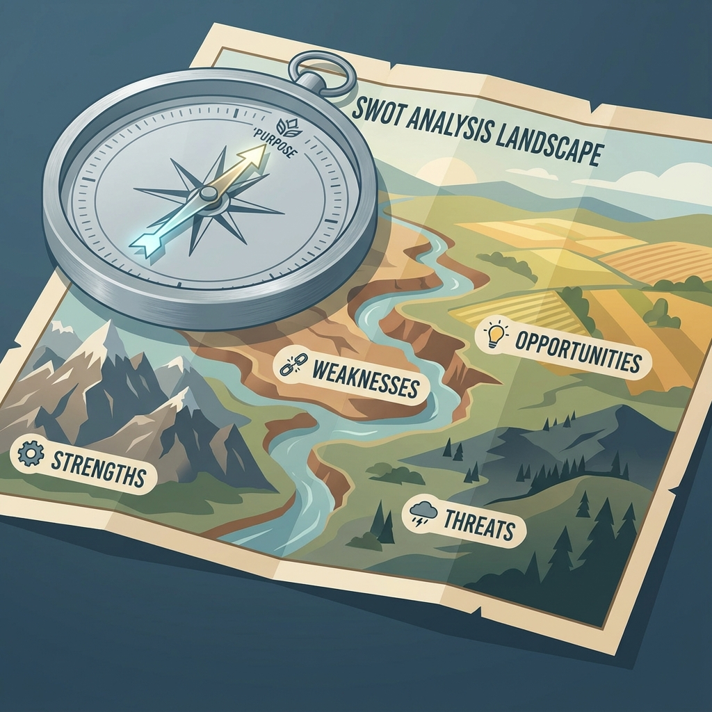

# MÓDULO 2: ¿DÓNDE ESTOY?

[Audio](../../media/modulo_2_tema_2.1__mi_ecosistema_.wav)

## TEMA 2.1. MI ECOSISTEMA (ANÁLISIS FODA PERSONAL)

### 1. EL CONTEXTO IMPORTA

Ya sabes quién eres (Módulo 1). Ahora, imagina que eres una semilla de roble. Tienes todo el potencial genético para ser un árbol gigante. Pero... ¿dónde estás plantado? ¿En un humedal fértil o en un desierto árido? ¿Hay sol o sombra?
Tu entorno (familia, país, economía, amigos) influye en tu crecimiento tanto como tu ADN.

## 2. LA HERRAMIENTA FODA (SWOT)

Originalmente usada por empresas, la matriz FODA es perfecta para analizar tu situación actual. Se divide en dos mundos: Interno (Tú) y Externo (El Entorno).

#### MUNDO INTERNO (Lo que tú controlas)

* **F - Fortalezas**: Tus "superpoderes". Lo que haces bien, tus talentos (Módulo 1), tu disciplina, tu salud.
* **D - Debilidades**: Tus "techos de cristal". Lo que te cuesta, tus miedos, falta de idiomas, mal manejo del tiempo.

#### MUNDO EXTERNO (Lo que NO controlas)

* **O - Oportunidades**: "Viento a favor". Becas disponibles, industrias en crecimiento, contactos familiares, cursos online gratuitos.
* **A - Amenazas**: "Viento en contra". Crisis económica, alta competencia, falta de recursos en tu ciudad, inestabilidad.

### 3. CÓMO CRUZAR LAS VARIABLES (ESTRATEGIA CAME)

Hacer la lista no sirve de nada si no actúas.

* **C**orregir Debilidades: ¿Mala gestión del tiempo? -> Uso una agenda.
* **A**frontar Amenazas: ¿Mucha competencia? -> Me especializo en algo único.
* **M**antener Fortalezas: ¿Soy bueno en inglés? -> Sigo practicando para no oxidarme.
* **E**xplotar Oportunidades: ¿Hay una beca? -> Aplico con mis fortalezas.

### 4. EL MITO DEL "HOMBRE HECHO A SÍ MISMO"

Nadie triunfa solo. Reconocer tus Oportunidades no es hacer trampa, es ser inteligente. Reconocer tus Amenazas no es ser pesimista, es ser realista para prepararte.

### 5. RESUMEN

No puedes cambiar el viento (Entorno), pero puedes ajustar las velas (Tú). El FODA te da el reporte meteorológico para que puedas navegar tu barco con seguridad.

---

## REFLEXIÓN FINAL

**Pregunta para reflexionar:** Mirando tu FODA, ¿qué oportunidad del entorno podrías aprovechar AHORA con tus fortalezas actuales? ¿Qué amenaza te da más miedo y cómo podrías prepararte para enfrentarla?

**Acción concreta:** Comparte tu matriz FODA con un mentor, profesor o familiar de confianza. Pídele que te señale una Fortaleza que tú subestimes y una Oportunidad que no hayas visto.

